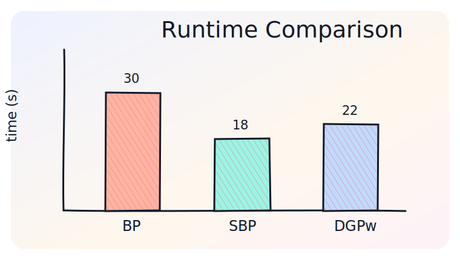
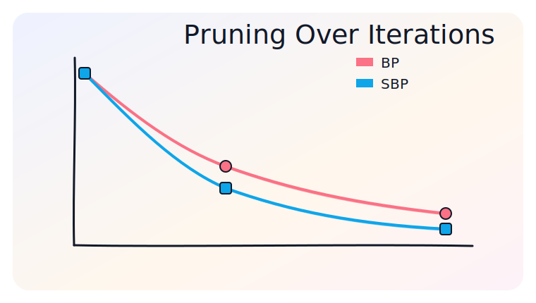
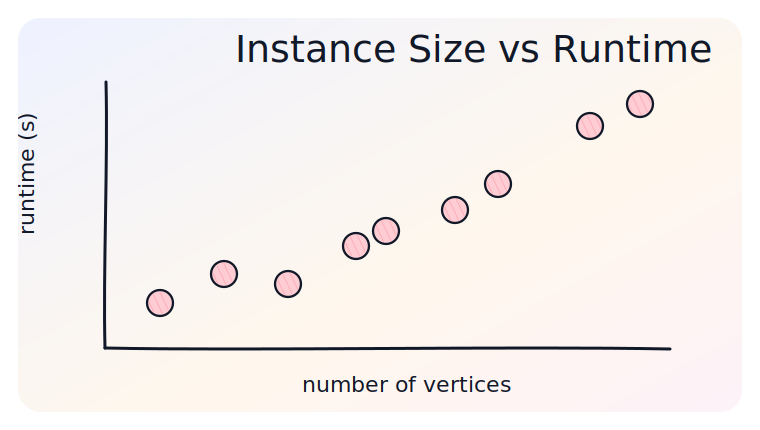
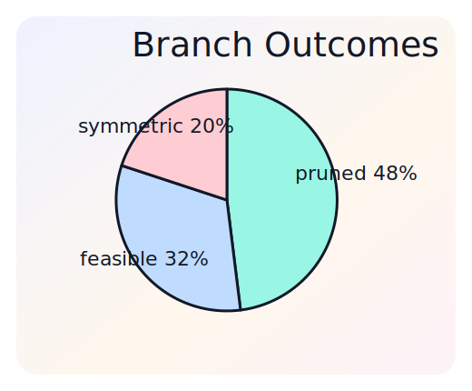
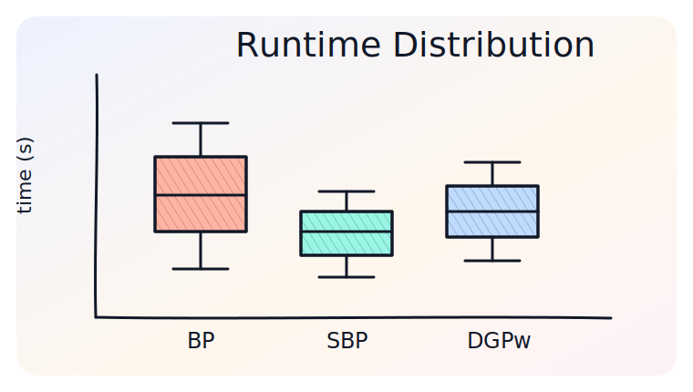

# Adding Hand-Drawn Charts

Este guia mostra como gerar gráficos em estilo hand-drawn para slides MARP: barras, linhas, scatter, pie e boxplot. A recomendação geral é gerar arquivos estáticos em `SVG` ou `PNG` e inseri-los no Markdown.

## Estrutura sugerida

```text
docs/
  add_charts.md
  add_charts_assets/
    html/
      chart_xkcd_examples.html
      roughjs_bar_chart.html
    images/
      bar_chart.svg
      line_chart.svg
      scatter_plot.svg
      pie_chart.svg
      boxplot.svg
    python/
      matplotlib_xkcd_charts.py
```

Inserção em MARP:

```markdown

```

## Opção 1: Python com Matplotlib `xkcd`

É a opção mais simples para gráficos acadêmicos reproduzíveis. Funciona bem para:

- bar charts;
- line charts;
- scatter plots;
- pie charts;
- boxplots;
- curvas de convergência;
- tempos de execução e número de nós explorados.

Código completo:

- [matplotlib_xkcd_charts.py](add_charts_assets/python/matplotlib_xkcd_charts.py)

Exemplo mínimo:

```python
import matplotlib.pyplot as plt

with plt.xkcd(scale=1.0, length=90, randomness=2):
    fig, ax = plt.subplots(figsize=(7, 4))
    ax.bar(["BP", "SBP", "DGPw"], [30, 18, 22],
           color="#ffb4a2", edgecolor="#111827", hatch="////")
    ax.set_title("Runtime Comparison")
    ax.set_ylabel("time (s)")
    fig.savefig("bar_chart.svg", bbox_inches="tight")
```

## Bar chart

Use barras quando a comparação entre categorias for o principal ponto do slide.


## Line chart

Use linhas para curvas de convergência, crescimento de árvore de busca ou evolução de erro.



## Scatter plot

Use scatter para mostrar instâncias, correlação entre erro e tempo, ou distribuição de soluções.



## Pie chart

Use pie charts com moderação. Eles funcionam melhor quando há poucas categorias e proporções bem distintas.



## Boxplot

Use boxplots para comparar distribuições de tempos, erros ou número de avaliações entre algoritmos.



## Opção 2: Chart.xkcd em HTML

Chart.xkcd oferece gráficos prontos com estética hand-drawn. É bom para protótipos rápidos e gráficos simples.

Código:

- [chart_xkcd_examples.html](add_charts_assets/html/chart_xkcd_examples.html)

Uso básico:

```html
<script src="https://cdn.jsdelivr.net/npm/chart.xkcd@1/dist/chart.xkcd.min.js"></script>
<svg class="bar-chart"></svg>
<script>
new chartXkcd.Bar(document.querySelector(".bar-chart"), {
  title: "Runtime Comparison",
  data: {
    labels: ["BP", "SBP", "DGPw"],
    datasets: [{ data: [30, 18, 22] }]
  },
  options: {
    yLabel: "time (s)",
    dataColors: ["#ff6b6b", "#0ea5e9", "#14b8a6"]
  }
});
</script>
```

## Opção 3: Rough.js para gráficos customizados

Quando o gráfico precisa ser mais diagramático, Rough.js dá mais controle que Chart.xkcd. É útil para:

- barras com hachura;
- eixos customizados;
- marcações manuais;
- gráficos misturados com diagramas geométricos.

Código:

- [roughjs_bar_chart.html](add_charts_assets/html/roughjs_bar_chart.html)

## Boas práticas

- Em slides acadêmicos, privilegie legibilidade sobre excesso de textura.
- Use no máximo duas ou três cores principais por gráfico.
- Mantenha eixos e rótulos grandes o suficiente para projeção.
- Para comparação entre algoritmos, prefira barras ou boxplots.
- Para convergência, use linhas.
- Para relação entre duas variáveis, use scatter.
- Para incerteza ou variabilidade, use boxplots ou intervalos.

