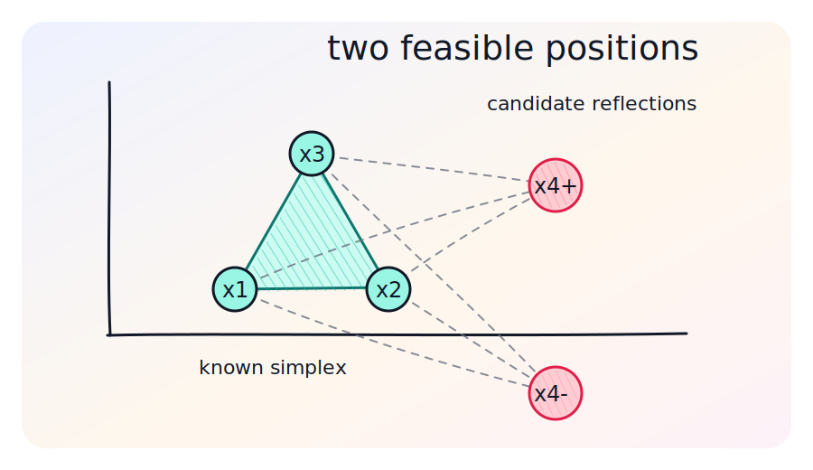
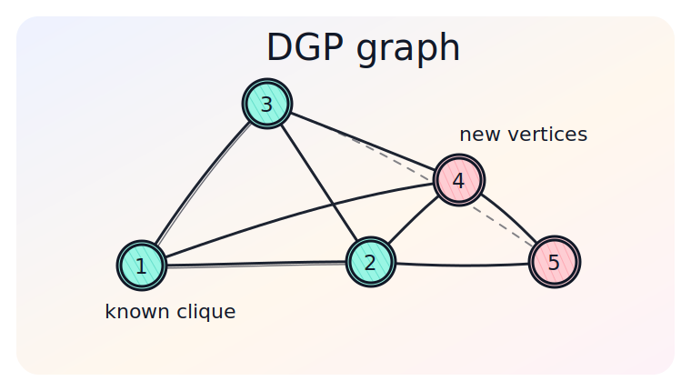
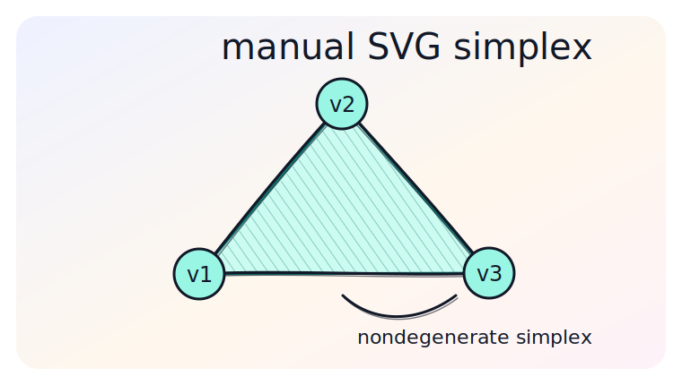

# Adding Custom Hand-Drawn Images

Este guia mostra como criar e inserir figuras customizadas em estilo hand-drawn nos slides MARP. A ideia é manter as figuras como arquivos estáticos em `slides/images/` ou em uma pasta de assets, e depois referenciá-las no Markdown.

## Estrutura sugerida

```text
docs/
  add_images.md
  add_images_assets/
    html/
      dgp_two_positions_roughjs.html
    images/
      dgp_two_positions.svg
      dgp_graph_networkx.svg
      manual_simplex.svg
    python/
      dgp_graph_networkx.py
```

Para usar uma figura nos slides:

```markdown

```

Em `slides/slides.md`, normalmente prefira caminhos relativos ao arquivo de slides:

```markdown

```

## Opção 1: HTML/SVG com Rough.js

Rough.js é uma das melhores opções para diagramas hand-drawn. Ele gera SVG com linhas levemente irregulares, hachuras e preenchimentos similares a desenho manual.

Exemplo disponível em:

- Código: [dgp_two_positions_roughjs.html](add_images_assets/html/dgp_two_positions_roughjs.html)
- Imagem usada aqui: [dgp_two_positions.svg](add_images_assets/images/dgp_two_positions.svg)


Uso típico:

```html
<script src="https://unpkg.com/roughjs/bundled/rough.js"></script>
<svg id="figure" width="900" height="520"></svg>
<script>
const svg = document.getElementById("figure");
const rc = rough.svg(svg);

svg.appendChild(rc.line(120, 360, 360, 360, {
  stroke: "#111827",
  strokeWidth: 3,
  roughness: 1.6
}));

svg.appendChild(rc.circle(520, 230, 64, {
  stroke: "#0f766e",
  strokeWidth: 3,
  fill: "#99f6e4",
  fillStyle: "hachure"
}));
</script>
```

## Opção 2: Python com NetworkX e Matplotlib

Para grafos de distância, árvores Branch-and-Prune, cliques e ordens discretizáveis, Python é mais conveniente. Use `networkx` para a estrutura e `matplotlib` para renderizar.

Exemplo disponível em:

- Código: [dgp_graph_networkx.py](add_images_assets/python/dgp_graph_networkx.py)
- Imagem usada aqui: [dgp_graph_networkx.svg](add_images_assets/images/dgp_graph_networkx.svg)



O ponto forte desse caminho é a reprodutibilidade: a figura pode ser gerada novamente quando os dados mudarem.

```python
import matplotlib.pyplot as plt
import networkx as nx

with plt.xkcd(scale=1.0, length=90, randomness=2):
    graph = nx.Graph()
    graph.add_edges_from([(1, 2), (2, 3), (1, 3), (1, 4), (2, 4), (3, 4)])
    pos = {1: (0, 0), 2: (1.5, 0), 3: (0.75, 1.2), 4: (2.2, 1.1)}

    nx.draw_networkx_edges(graph, pos, width=2.5, edge_color="#111827")
    nx.draw_networkx_nodes(graph, pos, node_size=900, node_color="#99f6e4", edgecolors="#111827")
    nx.draw_networkx_labels(graph, pos, font_size=15)
    plt.axis("off")
    plt.savefig("dgp_graph.svg", bbox_inches="tight")
```

## Opção 3: SVG escrito manualmente

Quando a figura é conceitual e pequena, SVG manual é suficiente. Para simular o estilo hand-drawn:

- use linhas duplicadas com pequenas variações;
- use `stroke-linecap="round"` e `stroke-linejoin="round"`;
- adicione hachuras com `<pattern>`;
- evite alinhamento perfeito demais;
- prefira cores suaves e contornos escuros.

Trecho típico:

```xml
<line x1="120" y1="360" x2="360" y2="358"
      stroke="#111827" stroke-width="3"
      stroke-linecap="round"/>
<line x1="121" y1="363" x2="361" y2="361"
      stroke="#111827" stroke-width="1.4"
      stroke-linecap="round" opacity="0.75"/>
```

Exemplo disponível em:

- Imagem usada aqui: [manual_simplex.svg](add_images_assets/images/manual_simplex.svg)



Neste exemplo, o estilo hand-drawn vem de três decisões simples:

- duas linhas quase coincidentes para cada aresta;
- pontos levemente deslocados em relação à grade ideal;
- hachura SVG aplicada ao simplex.

## Recomendações para a apresentação

- Use `SVG` para diagramas, porque escala bem no PDF.
- Use `PNG` apenas quando houver textura, rasterização ou exportação externa.
- Para figuras matemáticas, mantenha textos curtos dentro da imagem e deixe definições no slide.
- Para DGP, use uma paleta consistente: contorno escuro, verde para pontos conhecidos, rosa/laranja para alternativas, cinza para restrições auxiliares.
- Exporte imagens finais para `slides/images/` se elas forem usadas diretamente pela apresentação.
